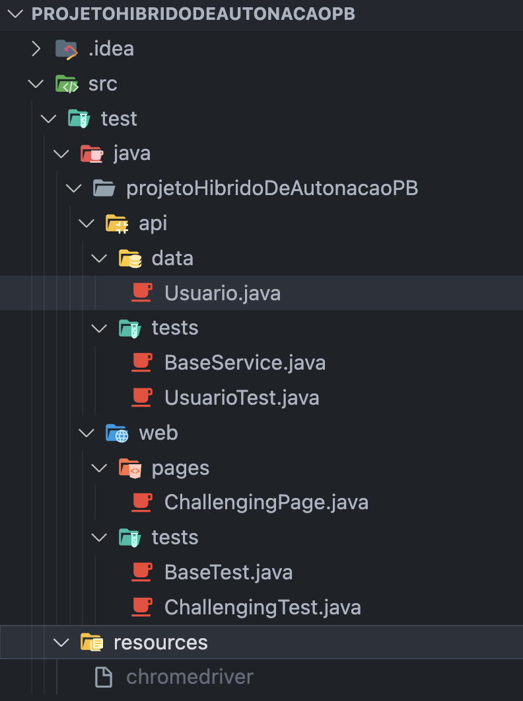

# Projeto de Automação Híbrido

Este projeto de automação é uma combinação de testes web usando Java, Maven, Selenium e JUnit, juntamente com testes de API usando RestAssured e Gson.

## Estrutura do Projeto

- `src/test/java/projetoHibridoDeAutonacaoPB/web`: Contém os testes de automação web.
- `src/test/java/projetoHibridoDeAutonacaoPB/api`: Contém os testes de automação de api.

 Obs para executar os testes web, baixar a versao do 'chromedrive.exe', equivalente a versao instalada no computador!

## Configuração

Certifique-se de ter as seguintes ferramentas instaladas e configuradas corretamente:

- Java 11
- Maven

Para instalar as dependências do projeto, execute o seguinte comando:

> mvn clean install

## Executando Testes

### Testes Web

Para executar os testes web, use o seguinte comando:
>mvn test -Dtest=projetoHibridoDeAutonacaoPB.web.tests.ChallengingTest

### Testes de API

Para executar os testes de API, use o seguinte comando:
>mvn test -Dtest=projetoHibridoDeAutonacaoPB.api.tests.UsuarioTest

## Refencias
LinkDin e GitHub:

- [LinkedIn](Fabiano-dias-de-andrade): [https://www.linkedin.com/in/fabiano-dias-de-andrade-4846345b](https://www.linkedin.com/in/fabiano-dias-de-andrade-4846345b)
- [GitHub](Fabianofda): [https://github.com/fabianofda](https://github.com/fabianofda)
